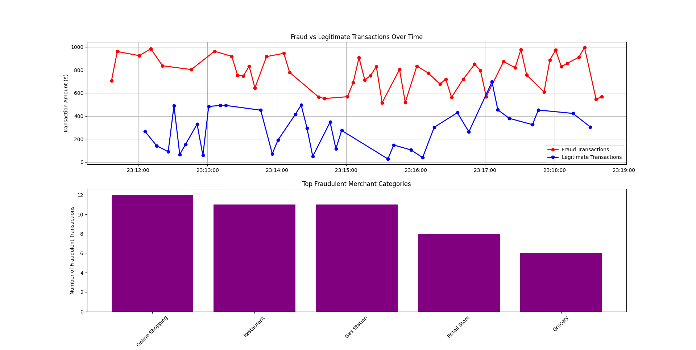

# Fraud Detection Pipeline

## Introduction
This project implements a **Kafka-based fraud detection pipeline** that processes financial transactions in real-time. It identifies fraudulent transactions based on predefined rules and visualizes insights dynamically.

## Features
✅ Real-time transaction processing using **Kafka**
✅ Fraud detection using **predefined business rules**
✅ Data storage in **SQLite** for analysis
✅ **Dynamic visualization** of fraud vs legitimate transactions
✅ **Merchant category analysis** for fraud trends

---
# Manage Our Local Project Virtual Environment

## One-time Only: Create it 

Use the built in venv utility to create a local project virtual environment in a folder named .venv. 

Windows: 
```shell
py -3.11 -m venv .venv
```

Mac/Linux:
```zsh
python3 -3.11 -m venv .venv
```
## As Needed: Activate .venv and Install Packages

Run the following commands to activate our local project virtual environment 
and install necessary packages. 
Wait for each command to finish before running the next command. 

Windows: 

```shell
.venv\Scripts\activate
py -m pip install --upgrade pip setuptools wheel
py -m pip install --upgrade -r requirements.txt
```

Mac/Linux: 

```zsh
source .venv/bin/activate
python3 -m pip install --upgrade pip setuptools wheel
python3 -m pip install --upgrade -r requirements.txt
```

## Activate Every Time We Open a New Terminal 

Remember to always activate the .venv when opening a new terminal. 

Windows: 

```shell
.venv\Scripts\activate
```

Mac/Linux:

```shell
source .venv/bin/activate
```
## Start Zookeeper and Kafka (Takes 2 Terminals)

If Zookeeper and Kafka are not already running, you'll need to restart them.
See instructions at [SETUP-KAFKA.md] to:

1. Start Zookeeper Service ([link](https://github.com/denisecase/buzzline-02-case/blob/main/docs/SETUP-KAFKA.md#step-7-start-zookeeper-service-terminal-1))
2. Start Kafka Service ([link](https://github.com/denisecase/buzzline-02-case/blob/main/docs/SETUP-KAFKA.md#step-8-start-kafka-terminal-2))

## How It Works

### 🔄 **Kafka Producer (`producer_randleman.py`)**
The producer **generates transaction data** and sends messages to Kafka topics.

Each transaction message contains:
- `name`: User making the transaction
- `merchant`: Category of the purchase (e.g., Grocery, Online Shopping)
- `amount`: Transaction amount
- `purchase_location`: ZIP code of the purchase
- `home_location`: ZIP code of the user's home
- `type`: Payment method (Debit/Credit)
- `timestamp`: Date and time of transaction

**Running Producer & Generating messages:**
```bash
.venv\Scripts\activate
py -m producers.producer_randleman
```

---

### 📥 **Kafka Consumer (`consumer_transactions_randleman.py`)**
The consumer listens for incoming transactions, applies **fraud detection rules**, and stores results in an SQLite database.

#### **Fraud Detection Rules**
- 🚨 Transactions over **$900** are flagged as fraud.
- 🚨 Transactions **above $500** outside the home ZIP code are suspicious.
- 🚨 Large purchases from **Online Shopping/Retail Store** are flagged.
- 🚨 **Debit card** transactions over **$800** are marked as fraud.

**Running the consumer:**
```bash
.venv\Scripts\activate
py -m consumers.consumer_transactions_randleman
```

---

## Dynamic Visualization 📊
The pipeline generates real-time visual insights:

### **1️⃣ Fraud vs Legitimate Transactions Over Time**
- 📈 Red: Fraudulent transactions
- 📉 Blue: Legitimate transactions

### **2️⃣ Top Fraudulent Merchant Categories**
- 📊 Bar chart of merchants with the most fraud cases

**Fraud Visualization:**


---

## Technologies Used
- **Kafka** for real-time message streaming
- **SQLite** for local database storage
- **Matplotlib** for live data visualization
- **Python** for processing & business logic

---

## Conclusion
This pipeline provides a **real-time fraud detection system** with dynamic visualization. It helps understand transaction behaviors, detect fraudulent patterns, and identify high-risk merchants.

🚀 **Run the producer and consumer to see fraud detection in action!**
